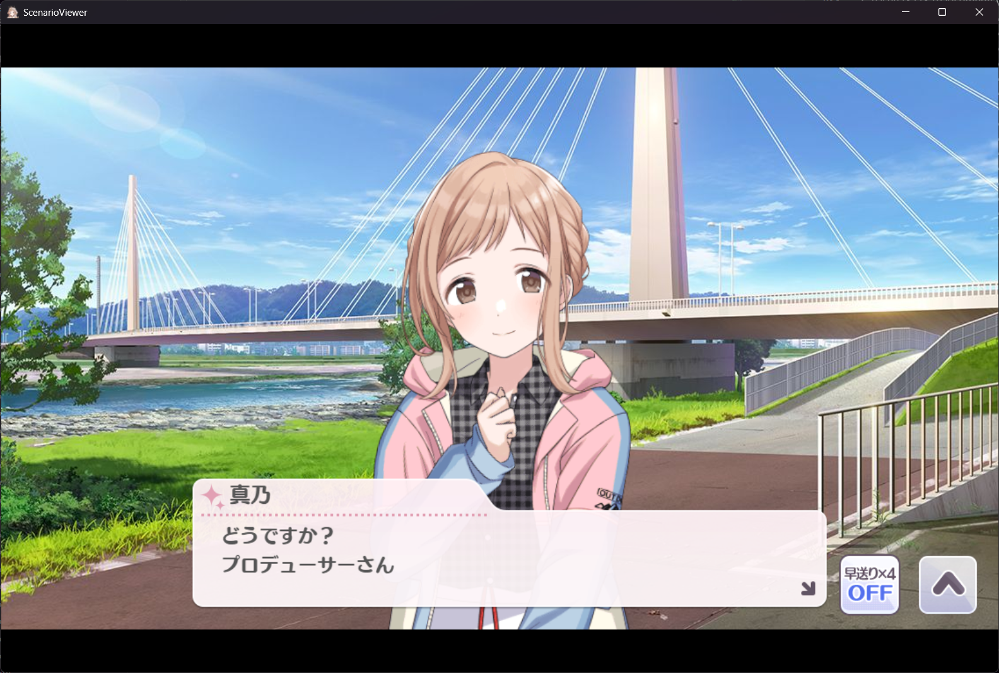
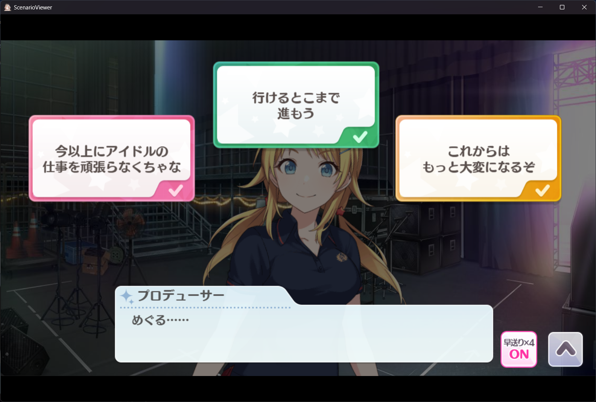
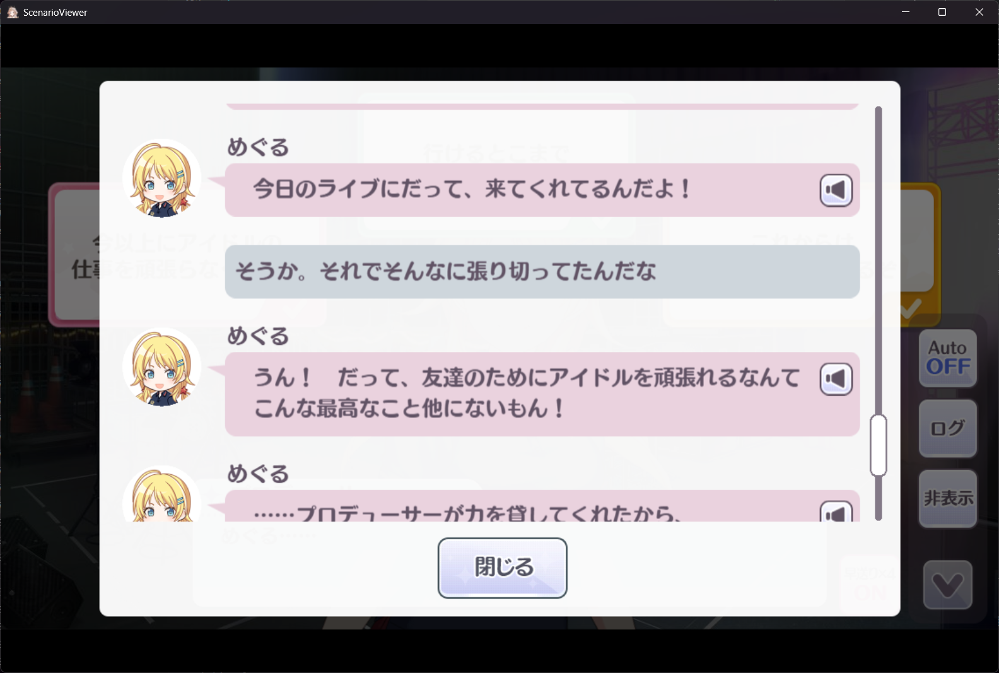
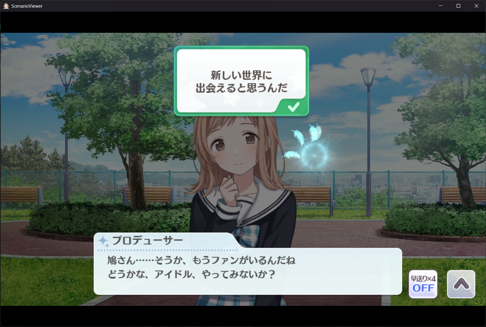
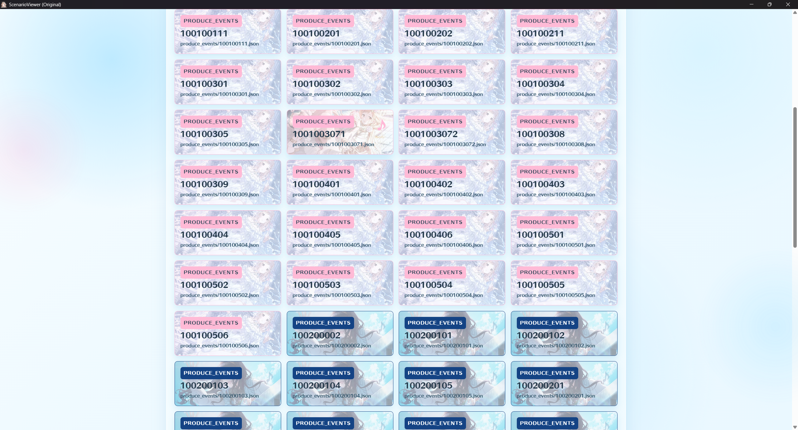
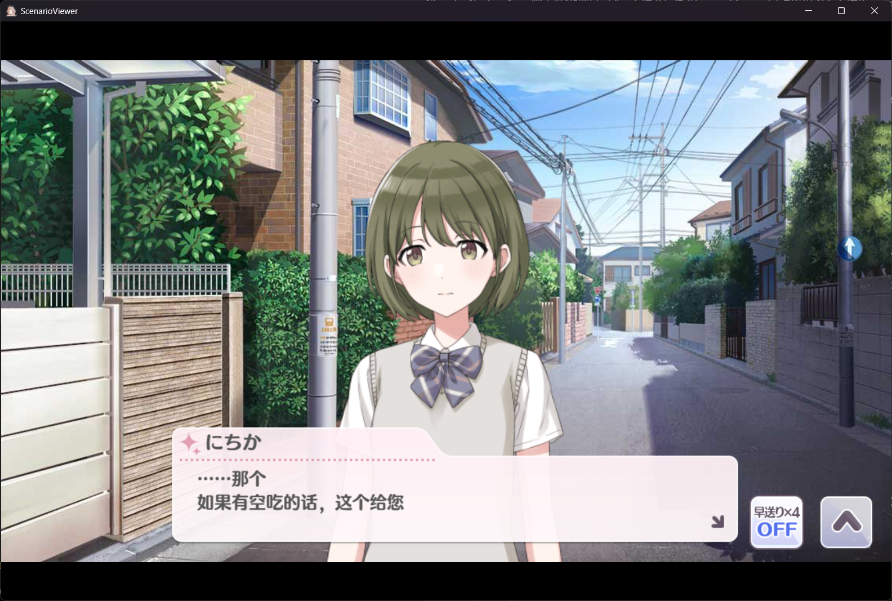
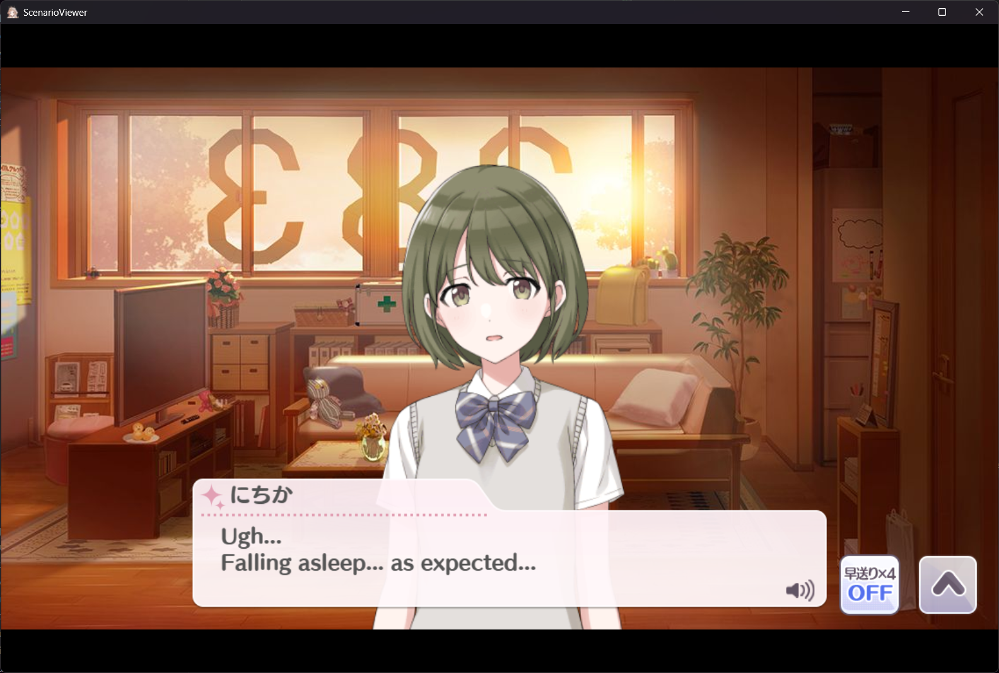
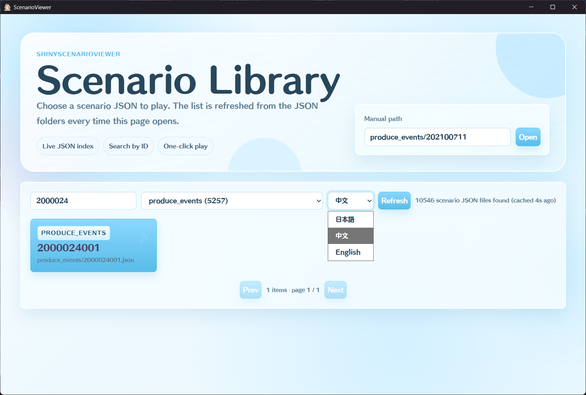

# ShinyScenarioViewer

[](https://github.com/AsaHikari/ShinyScenarioViewer/releases/tag/V1.1)
[](./LICENSE)

[中文](#中文) | [English](#english)

## 中文

ShinyScenarioViewer 是一个静态网页形式的 ADV 剧情播放器，基于 enza 版『アイドルマスター シャイニーカラーズ』前端播放器行为实现。

本仓库只包含播放器源码和资源路径约定，不包含游戏资源或剧情数据。运行前需要自行准备 `assets/` 下的资源文件。

> **免责声明**：本项目仅供学习、研究和个人使用。『アイドルマスター シャイニーカラーズ』相关内容和资源版权归 株式会社バンダイナムコエンターテインメント 所有。使用者应自行确保对相关游戏资源的访问和使用符合适用的法律及服务条款。开发者不提供任何游戏资源，也不对使用者的行为承担责任。

### 功能

- 播放本地准备的剧情 JSON。
- 支持文本、说话人、文本框、选项、日志、语音、SE、BGM、背景、前景、still、movie、Spine 等资源类型。
- 没有指定 `eventId` 时，会显示自制的可视化剧情入口页。
- 支持在日志界面重放语音。
- 支持 master、BGM、SE、voice 独立音量配置。
- 支持为 `produce_events` 入口卡片配置可选缩略图。
- **章节标题弹窗**：进入剧情时左上角弹出卡图+章节名
- 内置 Debug 面板，方便开发调试（按 ` 键呼出/隐藏）。

### V1.1 更新

- 增加 master、BGM、SE、voice 独立音量配置与 `config.example.json`。
- 默认清空章节标题映射，公开仓库不再附带具体章节数据。
- 修正支援卡图标路径及中英文语言/字体说明。
- 项目代码改用 GNU Affero General Public License v3.0 only。

### 章节标题弹窗

进入剧情时，左上角会弹出章节标题卡片，显示卡图头像和章节名称。弹窗会自动滑入、停留约 2.5 秒后淡出消失。

弹窗的元数据配置在 `scripts/ScenarioMetaIndex.js` 中。公开仓库默认使用空映射，不内置任何具体章节；下面仅为格式示例：

```js
const SCENARIO_META = {
    "produce_events/200100901": {                  //对应当前事件
        cardId: "1040010040",                            //对应左侧小图id
        name:   "秋香る",                                   //对应章节名称
        catIcon: "idol",                            //对应上方图标
    },
    // ...
};
```
`catIcon` 对应弹窗中的事件分类图标，来源为 `eventCategoryName`：

| catIcon | 图标 | 含义 |
|---|---|---|
| `"idol"` | `event_type_idol.png` | アイドルイベント |
| `"support"` | `event_type_support.png` | サポートイベント |
| `"produce"` | `event_type_produce.png` | プロデュースイベント |
| `"after"` | `event_type_true_end.png` | アフターストーリー（True End） |


可以自由修改，如下所示：
```JS

const SCENARIO_META = {
    "produce_events/200100901": {
        cardId: "1040010040",
        name:   "秋香る",
        catIcon: "after",
    },
    // ...
};
```


如果某个场景没有在对照表中注册，弹窗会自动跳过，不影响正常播放。


### Debug 面板（不稳定）

播放器内置了 Debug 面板，按 `` ` `` 键（反引号）呼出/隐藏。面板在右上角显示：

- 播放状态（FREE / PLAY / WAIT / LOCK）和速度模式
- 当前 Track 序号 / 总数
- 文字速度 / 等待时间 / 效果速度
- 语音播放状态

面板打开时的快捷键：

| 按键 | 功能 |
|---|---|
| `←` `→` | 调整文字速度 |
| `↑` `↓` | 调整等待时间 |
| `Space` | 跳过当前 Track |
| `S` | 循环切换速度模式 |

全局快捷键（无需打开面板）：

| 按键 | 功能 |
|---|---|
| `F1` | 重置所有视觉开关 |
| `F2` | 绿幕叠加（抠像合成用） |
| `F3` | 隐藏 Spine 角色 |
| `F4` | 隐藏对话框和控制按钮 |


### 截图









### 目录结构

| 路径 | 说明 |
| --- | --- |
| `index.html` | 浏览器入口文件。 |
| `main.js` | 应用启动、剧情加载和可视化入口页逻辑。 |
| `main.css` | 播放器和入口页样式。 |
| `scripts/` | 播放器核心模块。 |
| `lib/` | 播放器运行所需的 JavaScript 库。 |
| `config.example.json` | 可公开提交的音量配置示例。 |
| `config.json` | 本地运行时音量配置，已被 git 忽略。 |
| `assets/` | 本地运行资源目录，已被 git 忽略。 |

### assets 配置

`assets/` 不会提交到 git。请根据要播放的剧情自行准备资源。

目录结构：

```text
assets/
├─ json/
├─ fonts/
├─ images/
├─ sounds/
├─ spine/
├─ movies/
└─ thumbnail/
```

其中，thumbnail用来配置scenarioviewer的入口处缩略图。

播放器至少需要字体、UI 图集、文本框、日志框、头像和 UI 音效。具体剧情还可能引用背景、前景、语音、BGM、SE、still、movie、Spine 等资源。

资源根路径在 `scripts/Constants.js` 中配置：

```js
const ASSET_PATH = './assets';
const DOWNLOADS_PATH = './assets';
```

### 音量配置

复制 `config.example.json` 为 `config.json`，再按需调整各类音量。`config.json` 仅供本地运行使用，已被 git 忽略。

```json
{
  "masterVolume": 0.4,
  "bgmVolume": 0.5,
  "seVolume": 1.0,
  "voiceVolume": 1.0
}
```

### 剧情 JSON 入口

入口页会扫描 `assets/json/`，并按 event type 分组显示剧情。

```text
assets/
└─ json/
   ├─ produce_events/
   │  ├─ 100100001.json
   │  └─ 100200001.json
   ├─ support_events/
   │  └─ ...
   └─ special_communications/
      └─ ...
```

不带参数打开时，会进入可视化入口页：

```text
http://127.0.0.1:8000/
```



带参数打开时，会直接播放指定剧情：

```text
http://127.0.0.1:8000/?eventType=produce_events&eventId=100100001
```

如果省略 `eventType`，默认使用 `produce_events`。

### language URL 参数

播放器支持通过 URL query 参数切换显示语言。

可以识别并选择性播放 JSON 文件中的 text_cn，select_cn 等新字段。

当前约定：

- `language=cn`：优先使用 `text_cn` / `select_cn`
- `language=en`：优先使用 `text_en` / `select_en`
- 不传 `language`：使用原始 `text` / `select`（日文）

示例：

```JSON
  {
    "speaker": "プロデューサー",
    "text": "（ふぅ、あと少しだ……\r\nなんとか今日中に終わればいいんだけど……）",
    "textCtrl": "p",
    "textFrame": "002",
    "text_cn": "（呼，还差一点……\r\n希望能赶在今天之内完成……）",
    "text_en": "(Phew, just a little more...\r\nI hope I can finish it today somehow...)"
  },
  ```
  如果传入 `language` 的参数是 `cn`，那么优先选择播放 `text_cn`





```text
http://127.0.0.1:8000/?eventType=produce_events&eventId=100100001&language=cn
```

```text
http://127.0.0.1:8000/?eventType=produce_events&eventId=100100001&language=en
```

你也可以在可视化入口处切换语言



补充说明：

- 如果指定了 `language=cn`，但剧情 JSON 中没有 `text_cn` 或 `select_cn`，会自动回退到原始 `text` / `select`。
- `language=cn` 会优先使用 `Yuanti`，并以 `HummingStd-E-1` / `HummingStd-E-2` 作为后备字体。
- `language=en` 保持默认的 `HummingStd-E-1` / `HummingStd-E-2` 字体配置，不会加载 `Yuanti`。
- 对话日志界面的人物小头头像，是根据 `speaker` 来决定的，只有日文适配，非必要不建议翻译 `speaker`

### 可选缩略图

`produce_events` 入口卡片会从剧情 ID 中读取角色 ID，并可显示角色缩略图。

推荐尺寸：

```text
480x270
```

路径格式：

```text
assets/thumbnail/classic/001.jpg
assets/thumbnail/classic/002.jpg
...
assets/thumbnail/classic/028.jpg

assets/thumbnail/fes/001.jpg
assets/thumbnail/fes/002.jpg
...
assets/thumbnail/fes/028.jpg
```

`classic` 图片默认显示；如果存在对应 `fes` 图片，鼠标悬停时会淡入显示。


### 本地运行

请使用本地静态服务器运行。不要直接用 `file://` 打开 `index.html`，否则浏览器可能阻止 JSON 扫描或资源加载。

```bash
python -m http.server 8000
```

然后访问：

```text
http://127.0.0.1:8000/
```

### 剧情汉化与录制

如果你使用本项目播放并录制剧情内容，用于剧情汉化、视频投稿或相关展示，请在简介、说明或字幕组信息中标明使用了本项目。

### 许可证

本项目代码采用 [GNU Affero General Public License v3.0 only](./LICENSE)（SPDX：`AGPL-3.0-only`）。游戏资源和剧情数据不属于本许可证授权范围，也不会包含在本仓库中。

### Special thanks

- yesterday17：没有他就不会有这个项目。
- Euphokumiko / [ShinyColorsDB-EventViewer](https://github.com/ShinyColorsDB/ShinyColorsDB-EventViewer)：该项目对本项目的实现方向提供了很大启发。

---

## English

ShinyScenarioViewer is a static web-based ADV scenario player based on the frontend playback behavior of the enza version of 『アイドルマスター シャイニーカラーズ』.

This repository only contains the player source code and asset path conventions. Game assets and scenario data are not included. You must prepare the required files under `assets/` yourself.

> **Disclaimer**: This project is for educational, research, and personal use only. All 『アイドルマスター シャイニーカラーズ』 content and assets are the property of Bandai Namco Entertainment Inc. Users are responsible for ensuring their access to and use of game resources complies with applicable laws and terms of service. The developer does not provide any game resources and assumes no liability for users' actions.

### Features

- Plays locally prepared scenario JSON files.
- Supports text, speakers, text frames, choices, log view, voice, SE, BGM, backgrounds, foregrounds, still images, movies, and Spine resources.
- Shows a custom visual scenario entry page when no `eventId` is specified.
- Supports voice replay from the scenario log screen.
- Supports independent master, BGM, SE, and voice volume configuration.
- Supports optional thumbnails for `produce_events` entry cards.
- **Chapter title popup**: card icon + chapter name overlay
- UI control panel defaults to collapsed state.
- Built-in **Debug panel** for development (toggle with `` ` `` key).

### V1.1 changes

- Added independent master, BGM, SE, and voice volume settings with `config.example.json`.
- Cleared the default chapter-title mapping so the public repository ships without chapter-specific data.
- Fixed support-card icon paths and corrected the bilingual language/font documentation.
- Relicensed the project code under GNU Affero General Public License v3.0 only.

### Chapter Title Popup

When entering a scenario, a chapter title card pops up in the top-left corner showing the card icon and chapter name. The popup slides in, holds for ~2.5s, then fades out.

Metadata is configured in `scripts/ScenarioMetaIndex.js`. The public repository ships with an empty mapping and no built-in chapter entries; the following is only a format example:

```js
const SCENARIO_META = {
    "produce_events/200100901": {                  // scenario key
        cardId: "1040010040",                            // card icon ID (left side)
        name:   "秋香る",                                   // chapter name
        catIcon: "idol",                            // category icon (top-right)
    },
    // ...
};
```

`catIcon` maps to the event category icon from `eventCategoryName`:

| catIcon | Texture | Meaning |
|---|---|---|
| `"idol"` | `event_type_idol.png` | Idol event |
| `"support"` | `event_type_support.png` | Support idol event |
| `"produce"` | `event_type_produce.png` | Produce event |
| `"after"` | `event_type_true_end.png` | True End |


You can customize the popup freely, for example changing the category icon:

```js
const SCENARIO_META = {
    "produce_events/200100901": {
        cardId: "1040010040",
        name:   "秋香る",
        catIcon: "after",
    },
    // ...
};
```


If a scenario has no entry in the lookup table, the popup is skipped silently.


### Debug Panel (unstable)

Press `` ` `` (backtick) to toggle the debug overlay (top-left corner). It shows:

- Playback state (FREE / PLAY / WAIT / LOCK) and speed mode
- Current track number / total
- Text speed / wait time / effect speed
- Voice playback status

Hotkeys while overlay is open:

| Key | Action |
|---|---|
| `←` `→` | Adjust text speed |
| `↑` `↓` | Adjust wait time |
| `Space` | Skip current track |
| `S` | Cycle speed mode |

Global hotkeys (always available):

| Key | Action |
|---|---|
| `F1` | Reset all visual toggles |
| `F2` | Green screen overlay (for chroma-key compositing) |
| `F3` | Hide all Spine characters |
| `F4` | Hide dialogue box + control buttons |


### Screenshots


### Project structure

| Path | Description |
| --- | --- |
| `index.html` | Browser entry point. |
| `main.js` | App startup, scenario loading, and visual entry page logic. |
| `main.css` | Player and entry page styles. |
| `scripts/` | Core player modules. |
| `lib/` | JavaScript libraries required by the player. |
| `config.example.json` | Publicly shareable volume configuration example. |
| `config.json` | Local runtime volume configuration; ignored by git. |
| `assets/` | Local runtime assets. This directory is ignored by git. |

### Assets

`assets/` is ignored by git. Prepare the required assets according to the scenarios you want to play.

Recommended layout:

```text
assets/
├─ json/
├─ fonts/
├─ images/
├─ sounds/
├─ spine/
├─ movies/
└─ thumbnail/
```

thumbnail folder is used to configure the window which you choose the json file.

The player shell requires fonts, UI atlases, text frames, log frames, speaker icons, and UI sound effects. Individual scenarios may additionally reference backgrounds, foregrounds, voices, BGM, SE, still images, movies, and Spine data.

Asset roots are configured in `scripts/Constants.js`:

```js
const ASSET_PATH = './assets';
const DOWNLOADS_PATH = './assets';
```

### Volume configuration

Copy `config.example.json` to `config.json`, then adjust each volume as needed. `config.json` is for local runtime use only and is ignored by git.

```json
{
  "masterVolume": 0.4,
  "bgmVolume": 0.5,
  "seVolume": 1.0,
  "voiceVolume": 1.0
}
```

### Scenario JSON entry page

The entry page scans `assets/json/` and groups scenario files by event type.

```text
assets/
└─ json/
   ├─ produce_events/
   │  ├─ 100100001.json
   │  └─ 100200001.json
   ├─ support_events/
   │  └─ ...
   └─ special_communications/
      └─ ...
```

Open without parameters to show the visual entry page:

```text
http://127.0.0.1:8000/
```

Open with parameters to start playback directly:

```text
http://127.0.0.1:8000/?eventType=produce_events&eventId=100100001
```

If `eventType` is omitted, `produce_events` is used by default.

### `language` URL parameter

The player supports switching display language through a URL query parameter.

Current behavior:

- `language=cn`: prefers `text_cn` / `select_cn`
- `language=en`: prefers `text_en` / `select_en`
- no `language` parameter: uses the original `text` / `select` fields (Japanese)

Examples:

```
  {
    "speaker": "プロデューサー",
    "text": "（ふぅ、あと少しだ……\r\nなんとか今日中に終わればいいんだけど……）",
    "textCtrl": "p",
    "textFrame": "002",
    "text_cn": "（呼，还差一点……\r\n希望能赶在今天之内完成……）",
    "text_en": "(Phew, just a little more...\r\nI hope I can finish it today somehow...)"
  },
  ```
If `language = en` , ScenarioViewer will pick `text_en` and play automatically.

```text
http://127.0.0.1:8000/?eventType=produce_events&eventId=100100001&language=cn
```

```text
http://127.0.0.1:8000/?eventType=produce_events&eventId=100100001&language=en
```


You can also switch language in the entry page:


Notes:

- If `language=en` is provided but the scenario JSON does not contain `text_en` or `select_en`, the player automatically falls back to the original `text` / `select`.
- Under `language=cn`, the player prefers `Yuanti` and falls back to `HummingStd-E-1` / `HummingStd-E-2`.
- Under `language=en`, the player keeps the default `HummingStd-E-1` / `HummingStd-E-2` font configuration and does not load `Yuanti`.
- The Character circle icon shown in log window is defined and decided by the `speaker`. So I recommend not to change it if not necessary.

### Optional thumbnails

For `produce_events`, the entry page reads the character ID from the scenario ID and can show optional thumbnails.

Recommended size:

```text
480x270
```

Expected paths:

```text
assets/thumbnail/classic/001.jpg
assets/thumbnail/classic/002.jpg
...
assets/thumbnail/classic/028.jpg

assets/thumbnail/fes/001.jpg
assets/thumbnail/fes/002.jpg
...
assets/thumbnail/fes/028.jpg
```

`classic` images are shown by default. If a matching `fes` image exists, it fades in on hover.

### Running locally

Use a local static server. Do not open `index.html` directly with `file://`, because browsers may block JSON directory scanning or asset loading.

```bash
python -m http.server 8000
```

Then open:

```text
http://127.0.0.1:8000/
```

### Scenario translation and recording

If you use this project to play and record scenarios for translation, video uploads, or related presentations, please mention that this project was used in the description, credits, or translation notes.

### License

The project code is licensed under the [GNU Affero General Public License v3.0 only](./LICENSE) (SPDX: `AGPL-3.0-only`). Game assets and scenario data are outside the scope of this license and are not included in this repository.

### Special thanks

- yesterday17: This project would not exist without him.
- Euphokumiko / [ShinyColorsDB-EventViewer](https://github.com/ShinyColorsDB/ShinyColorsDB-EventViewer): This project was a major source of inspiration for ShinyScenarioViewer.
