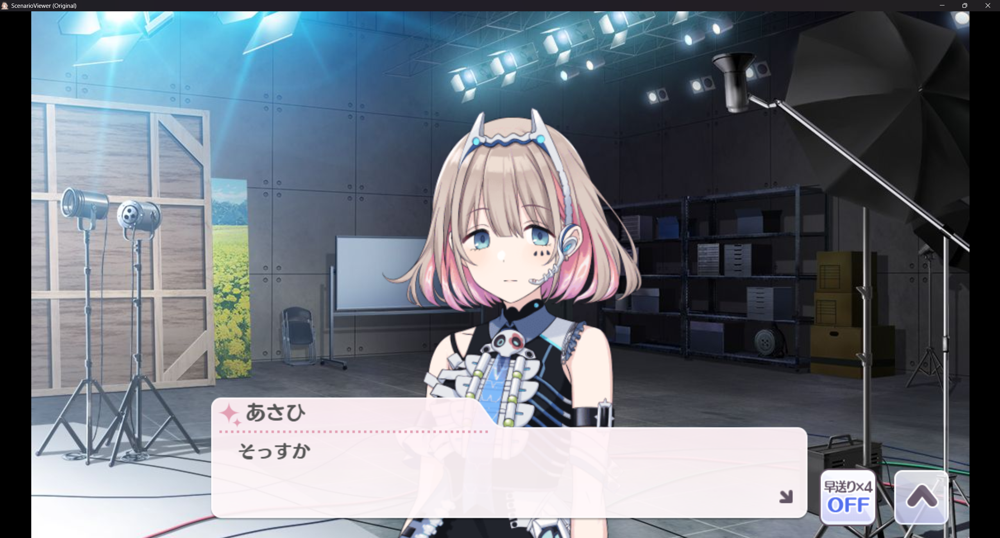
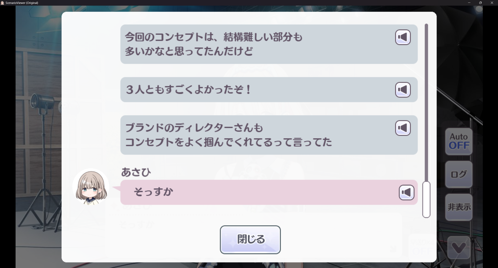

# ShinyScenarioViewer

[中文](#中文) | [English](#english)

## 中文

ShinyScenarioViewer 是一个静态网页形式的 ADV 剧情播放器，基于 enza 版『アイドルマスター シャイニーカラーズ』前端播放器行为实现。

本仓库只包含播放器源码和资源路径约定，不包含游戏资源或剧情数据。运行前需要自行准备 `assets/` 下的资源文件。

### 功能

- 播放本地准备的剧情 JSON。
- 支持文本、说话人、文本框、选项、日志、语音、SE、BGM、背景、前景、still、movie、Spine 等资源类型。
- 没有指定 `eventId` 时，会显示自制的可视化剧情入口页。
- 支持在日志界面重放语音。
- 支持为 `produce_events` 入口卡片配置可选缩略图。

### 截图





### 目录结构

| 路径 | 说明 |
| --- | --- |
| `index.html` | 浏览器入口文件。 |
| `main.js` | 应用启动、剧情加载和可视化入口页逻辑。 |
| `main.css` | 播放器和入口页样式。 |
| `scripts/` | 播放器核心模块。 |
| `lib/` | 播放器运行所需的 JavaScript 库。 |
| `assets/` | 本地运行资源目录，已被 git 忽略。 |

### assets 配置

`assets/` 不会提交到 git。请根据要播放的剧情自行准备资源。

目录结构：

```text
assets/
├─ json/
├─ fonts/
├─ images/
├─ sounds/
├─ spine/
├─ movies/
└─ thumbnail/
```

其中，thumbnail用来配置scenarioviewer的入口处缩略图。

播放器至少需要字体、UI 图集、文本框、日志框、头像和 UI 音效。具体剧情还可能引用背景、前景、语音、BGM、SE、still、movie、Spine 等资源。

资源根路径在 `scripts/Constants.js` 中配置：

```js
const ASSET_PATH = './assets';
const DOWNLOADS_PATH = './assets';
```

### 剧情 JSON 入口

入口页会扫描 `assets/json/`，并按 event type 分组显示剧情。

```text
assets/
└─ json/
   ├─ produce_events/
   │  ├─ 100100001.json
   │  └─ 100200001.json
   ├─ support_events/
   │  └─ ...
   └─ special_communications/
      └─ ...
```

不带参数打开时，会进入可视化入口页：

```text
http://127.0.0.1:8000/
```

带参数打开时，会直接播放指定剧情：

```text
http://127.0.0.1:8000/?eventType=produce_events&eventId=100100001
```

如果省略 `eventType`，默认使用 `produce_events`。

### 可选缩略图

`produce_events` 入口卡片会从剧情 ID 中读取角色 ID，并可显示角色缩略图。

推荐尺寸：

```text
480x270
```

路径格式：

```text
assets/thumbnail/classic/001.jpg
assets/thumbnail/classic/002.jpg
...
assets/thumbnail/classic/028.jpg

assets/thumbnail/fes/001.jpg
assets/thumbnail/fes/002.jpg
...
assets/thumbnail/fes/028.jpg
```

`classic` 图片默认显示；如果存在对应 `fes` 图片，鼠标悬停时会淡入显示。

### 本地运行

请使用本地静态服务器运行。不要直接用 `file://` 打开 `index.html`，否则浏览器可能阻止 JSON 扫描或资源加载。

```bash
python -m http.server 8000
```

然后访问：

```text
http://127.0.0.1:8000/
```

### Special thanks

- yesterday17：没有他就不会有这个项目。
- Euphokumiko / [ShinyColorsDB-EventViewer](https://github.com/ShinyColorsDB/ShinyColorsDB-EventViewer)：该项目对本项目的实现方向提供了很大启发。

---

## English

ShinyScenarioViewer is a static web-based ADV scenario player based on the frontend playback behavior of the enza version of 『アイドルマスター シャイニーカラーズ』.

This repository only contains the player source code and asset path conventions. Game assets and scenario data are not included. You must prepare the required files under `assets/` yourself.

### Features

- Plays locally prepared scenario JSON files.
- Supports text, speakers, text frames, choices, log view, voice, SE, BGM, backgrounds, foregrounds, still images, movies, and Spine resources.
- Shows a custom visual scenario entry page when no `eventId` is specified.
- Supports voice replay from the scenario log screen.
- Supports optional thumbnails for `produce_events` entry cards.

### Screenshots


### Project structure

| Path | Description |
| --- | --- |
| `index.html` | Browser entry point. |
| `main.js` | App startup, scenario loading, and visual entry page logic. |
| `main.css` | Player and entry page styles. |
| `scripts/` | Core player modules. |
| `lib/` | JavaScript libraries required by the player. |
| `assets/` | Local runtime assets. This directory is ignored by git. |

### Assets

`assets/` is ignored by git. Prepare the required assets according to the scenarios you want to play.

Recommended layout:

```text
assets/
├─ json/
├─ fonts/
├─ images/
├─ sounds/
├─ spine/
├─ movies/
└─ thumbnail/
```

thumbnail folder is used to configure the window which you choose the json file.

The player shell requires fonts, UI atlases, text frames, log frames, speaker icons, and UI sound effects. Individual scenarios may additionally reference backgrounds, foregrounds, voices, BGM, SE, still images, movies, and Spine data.

Asset roots are configured in `scripts/Constants.js`:

```js
const ASSET_PATH = './assets';
const DOWNLOADS_PATH = './assets';
```

### Scenario JSON entry page

The entry page scans `assets/json/` and groups scenario files by event type.

```text
assets/
└─ json/
   ├─ produce_events/
   │  ├─ 100100001.json
   │  └─ 100200001.json
   ├─ support_events/
   │  └─ ...
   └─ special_communications/
      └─ ...
```

Open without parameters to show the visual entry page:

```text
http://127.0.0.1:8000/
```

Open with parameters to start playback directly:

```text
http://127.0.0.1:8000/?eventType=produce_events&eventId=100100001
```

If `eventType` is omitted, `produce_events` is used by default.

### Optional thumbnails

For `produce_events`, the entry page reads the character ID from the scenario ID and can show optional thumbnails.

Recommended size:

```text
480x270
```

Expected paths:

```text
assets/thumbnail/classic/001.jpg
assets/thumbnail/classic/002.jpg
...
assets/thumbnail/classic/028.jpg

assets/thumbnail/fes/001.jpg
assets/thumbnail/fes/002.jpg
...
assets/thumbnail/fes/028.jpg
```

`classic` images are shown by default. If a matching `fes` image exists, it fades in on hover.

### Running locally

Use a local static server. Do not open `index.html` directly with `file://`, because browsers may block JSON directory scanning or asset loading.

```bash
python -m http.server 8000
```

Then open:

```text
http://127.0.0.1:8000/
```

### Special thanks

- yesterday17: This project would not exist without him.
- Euphokumiko / [ShinyColorsDB-EventViewer](https://github.com/ShinyColorsDB/ShinyColorsDB-EventViewer): This project was a major source of inspiration for ShinyScenarioViewer.
